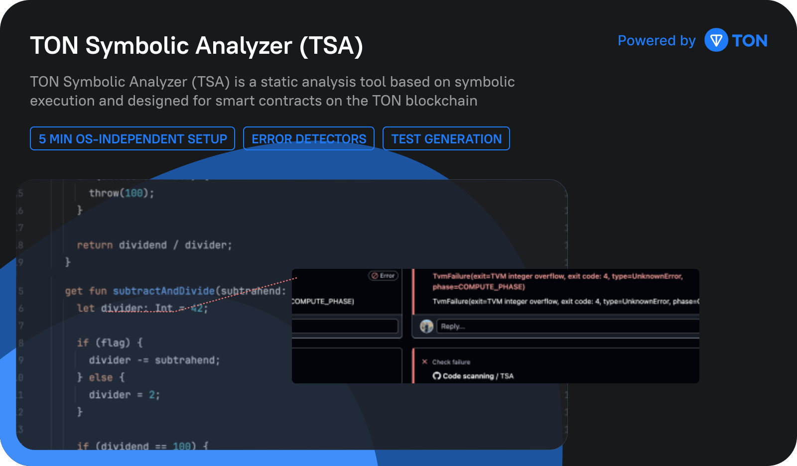
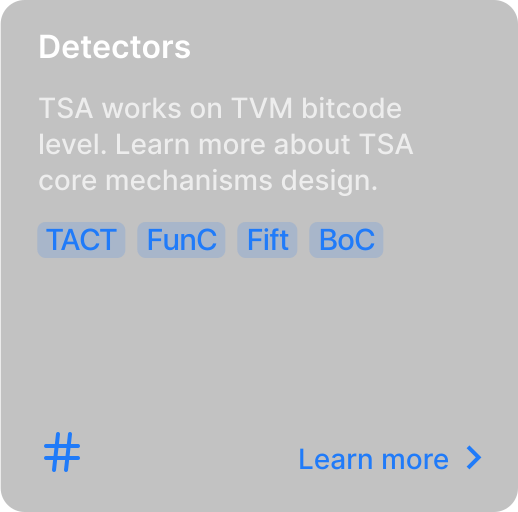

# Symbolic analyzer for TON smart contracts
{: .no_toc }

  

    
  

  

    

      
    

    

      
    

    

      
    

  

### Funding
TSA has been funded by the [TON Foundation grant](https://github.com/ton-society/grants-and-bounties/issues/489) grant and has been developed under the [8-month roadmap](https://questbook.app/dashboard/?proposalId=667ee6b9b59d3e9ae042d6c9&chainId=10&role=builder&isRenderingProposalBody=true&grantId=65c7836df27e2e1702d2d279).

### Inspiration

TSA is inspired and is actively using the [Universal Symbolic Virtual Machine(USVM)](https://github.com/UnitTestBot/usvm) –
a symbolic core engine for multiple programming languages.

You are very welcome to contribute to this project.
